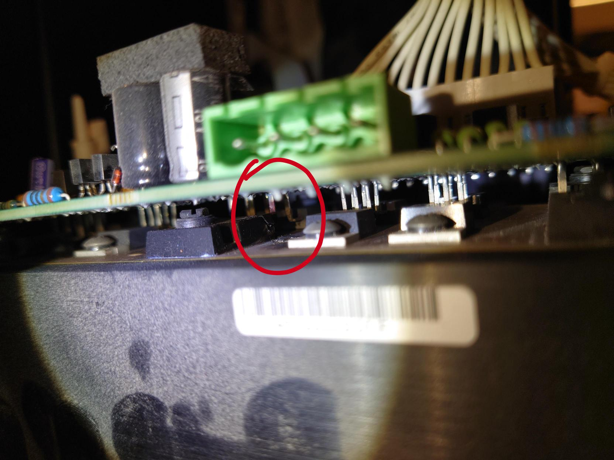
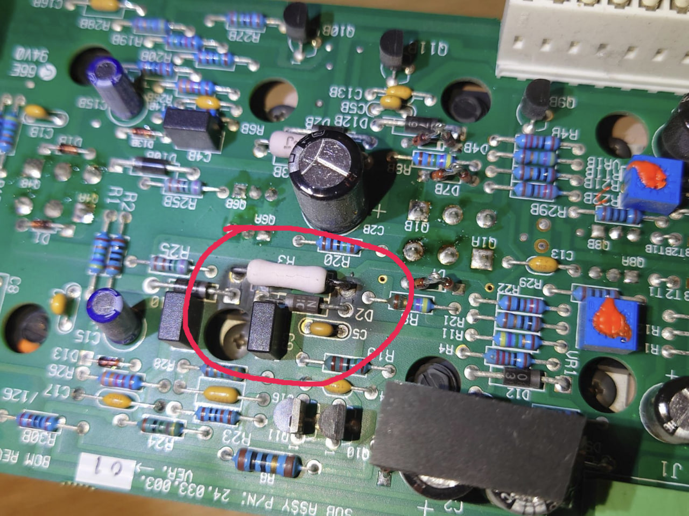
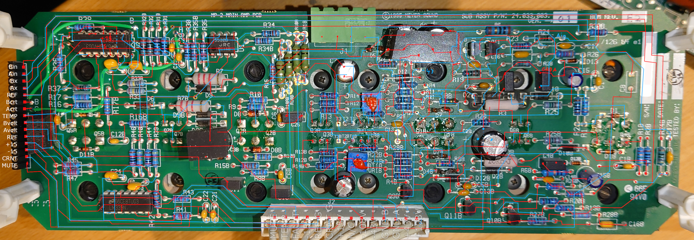
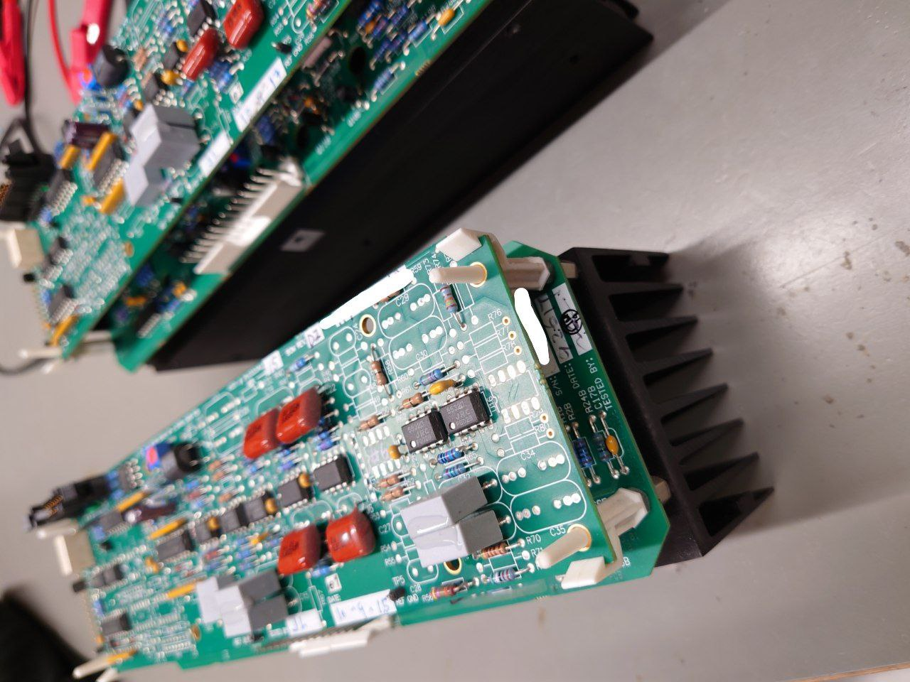

# Meyer Sound Amplifier Board Reverse Engineering

I received two faulty Meyer Sound X-800C electronics modules. A quick look revealed one exploded power MOSFET on the amplifier PCB (`24.033.003`). Interestingly, the exact same MOSFET (`Q1A`) had exploded on the second module too.  
Some other components on the PCB got noticably hot / damaged too (R3, D2, D7, D10).

|  |    |
| ----------------------- | ------------------------ |
|             |  |

To better estimate what other components could be damaged, I started to reverse engineer the PCB. But I've fallen into a bit of a rabbit hole and have almost completely reverse-engineered the PCB now... Oops ^^"  
From what I can tell, the stacked pre-amp/control board (`24.033.042`) should've been unaffected by the fault.

In this repository you can find:
- a GIMP image file containing front & back of the PCB with traced traces for better readability
- KiCad schematic of the reverse engineered circuit
  - (as of right now, only the analog amplifier part, none of the feedback)
- Some images of the module / PCB

As far as I know, the same amplifier PCB can also be found in the Meyer Sound MP-2/4, Hp-2, MSL-4, 700HP.
And the assembly number for the complete assembly (heat sink, amp board, pre-amp board) is `40.033.013.01`  

### Disclaimer
The documents listed above have been created by me and are provided as-is.

We are not affiliated, associated, authorized, endorsed by, or in any way officially connected with Meyer Sound, or any of its subsidiaries or its affiliates.  
The names Meyer Sound as well as related names, marks, emblems and images are registered trademarks of their respective owners.

